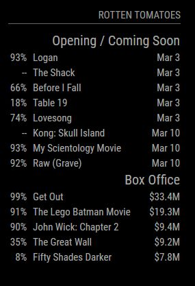

# Module: Rotten Tomatoes
The `MMM-RottenTomatoes` module is designed to, without any API keys, show movies that are ranking at the box office, opening this week, or coming soon. For each movies the Rotten Tomato meter score is shown (if available) as well as release date or box office gross.

Example:

 

## Dependencies / Requirements

This module requires the use of the `rt-scraper` package for node.js. To install this please run `npm install rt-scraper` from the MMM-RottenTomatoes module directory inside your Magic Mirror installation directory.

## Operation

This module is straight-forward to use and requires no special configuration other than standard Magic Mirror positioning. 

Optional configurations are available, see below for more.

## Configuration options

The following properties can be configured:

<table width="100%">
	<!-- why, markdown... -->
	<thead>
		<tr>
			<th>Option</th>
			<th width="100%">Description</th>
		</tr>
	<thead>
	<tbody>	
		<tr>
			<td><code>showHeader</code></td>
			<td>Boolean value, should a header be shown. If true, will show "Rotten Tomatoes". 
				 <b>Example:</b> <code>false</code>
				 <b>Default value:</b> <code>true</code>
				 This value is <b>OPTIONAL</b>
			</td>
		</tr>		
		<tr>
			<td><code>showBoxOffice</code></td>
			<td>Boolean value, should the box office section be shown. 
				 <b>Example:</b> <code>false</code>
				 <b>Default value:</b> <code>true</code>
				 This value is <b>OPTIONAL</b>
			</td>
		</tr>
		<tr>
			<td><code>showOpeningThisWeek</code></td>
			<td>Boolean value, should the movies opening this week section be shown. 
				 <b>Example:</b> <code>false</code>
				 <b>Default value:</b> <code>true</code>
				 This value is <b>OPTIONAL</b>
			</td>
		</tr>
		<tr>
			<td><code>showComingSoon</code></td>
			<td>Boolean value, should the movies coming soon section be shown. 
				 <b>Example:</b> <code>false</code>
				 <b>Default value:</b> <code>true</code>
				 This value is <b>OPTIONAL</b>
			</td>
		</tr>    
        <tr>
			<td><code>limitBoxOffice</code></td>
			<td>The number of movies to be shown in the box office listing. Setting to zero will show all available. 
				 <b>Example:</b> <code>4</code>
				 <b>Default value:</b> <code>3</code>
				 This value is <b>OPTIONAL</b>
			</td>
		</tr>
        <tr>
			<td><code>limitOpeningThisWeek</code></td>
			<td>The number of movies to be shown in the opening this week listing. Setting to zero will show all available. 
				 <b>Example:</b> <code>4</code>
				 <b>Default value:</b> <code>3</code>
				 This value is <b>OPTIONAL</b>
			</td>
		</tr>      
        <tr>
			<td><code>limitComingSoon</code></td>
			<td>The number of movies to be shown in the coming soon listing. Setting to zero will show all available. 
				 <b>Example:</b> <code>4</code>
				 <b>Default value:</b> <code>3</code>
				 This value is <b>OPTIONAL</b>
			</td>
		</tr>   
		<tr>
			<td><code>boxOfficeAfter</code></td>
			<td>Boolean value, should the box office listing be shown after the opening this week / coming soon sections. If set to false will be shown before. 
				 <b>Example:</b> <code>false</code>
				 <b>Default value:</b> <code>true</code>
				 This value is <b>OPTIONAL</b>
			</td>
		</tr>   
        <tr>
			<td><code>mergeOpeningAndComingSoon</code></td>
			<td>Boolean value, should the opening this week and coming soon sections be merged or seperate. 
				 <b>Example:</b> <code>false</code>
				 <b>Default value:</b> <code>true</code>
				 This value is <b>OPTIONAL</b>
			</td>
		</tr> 
    </tbody>
</table>
